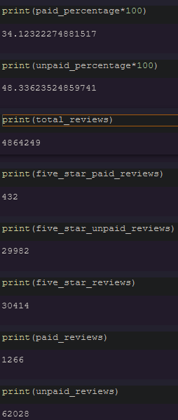

# Amazon_Vine_Analysis
## Overview
In this weeks challenge we looked at review data from amazon products. The main goal was to find if the vine program made biased reviews. The vine program is a program where amazon pays people to give reviews in order to get more reviews on their products. If done correctly it is not a bad idea however we will see what the data says about it in practice.
## Results
-- How many vine reviews and non-vine reviews were there? There was approximately 4,864,249 reviews

-- How many Vine reviews were 5 stars? There was 432 vine reviews.

-- How many non-Vine reviews were 5 stars? There was 29,982 non-vine reviews.

-- What percentage of Vine reviews were 5 stars? The percentage of vine reviews that were 5 stars was %34.12.

-- What percentage of non-Vine reviews were 5 stars? The percentage of non-vine reviews that were 5 stars was %48.34.

## Summary
Looking at the data gathered from this challenge, there seems to be little evidence that the vine program has any bias. As a matter of fact the vine reviews had a lower 5 star review percentage than the non-vine reviews by %14.22. Therefore I think it is safe to say that the vine program does not have any bias, at least with the products that we looked at in this challenge.
We could go further to help or disprove the vine program by analyzing even more data seen as we have the code setup for it, it would not be difficult and could prove useful to show how the vine program does not hold any bias.
